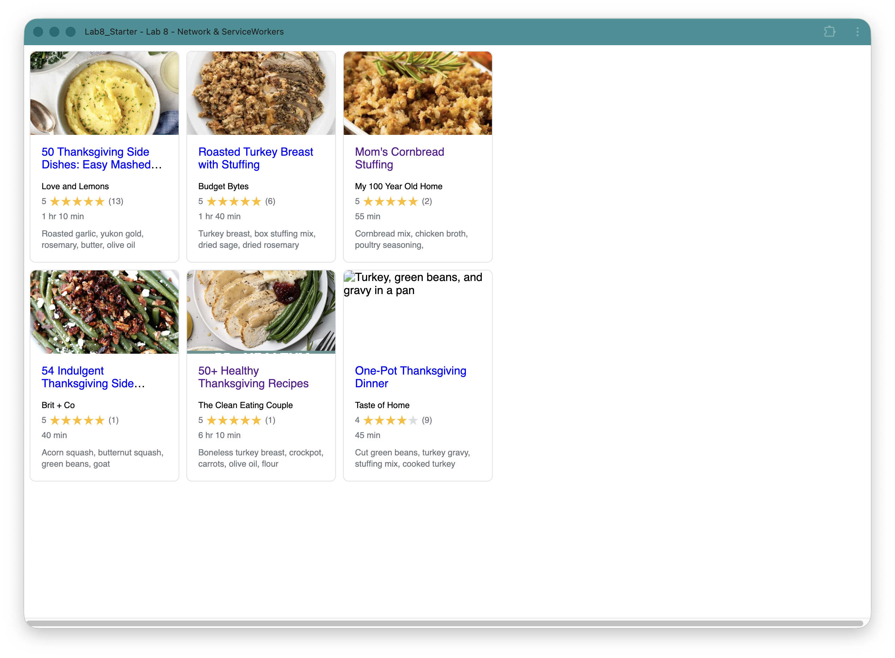

# Lab 8 
Beckham Yeoh

https://beckhamyeoh.github.io/Lab8_Starter/

## Graceful Degradation & Service Workers
Graceful degradation is the practice of building an app with full functionality first and then making sure it still works acceptably when conditions get worse like an unstable network. Service workers are a tool between the app and the network that intercept requests and can serve cached responses when the network is slow or completely gone. Instead of the app not working when offline, it degrades gracefully from live data down to cached data, giving users a usable experience either way.

## PWA Screenshot

